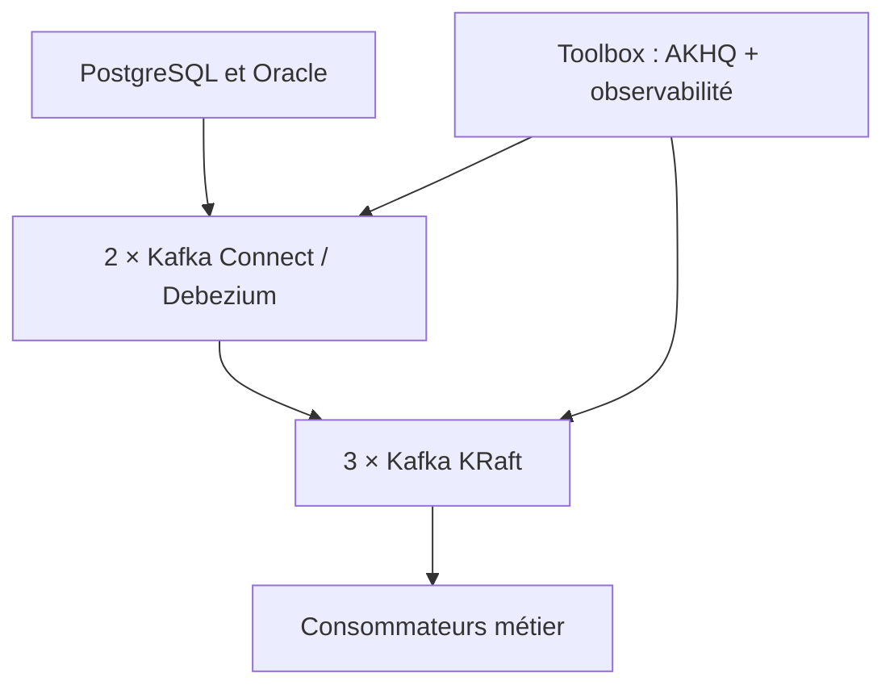

# Stack CDC Kafka / Debezium hors-ligne sur RHEL 8.10 — v1.1.0 sans PKI

Ce projet installe la plateforme convenue sur des VM `x86_64` :

- 3 brokers Apache Kafka 3.9.2 en mode KRaft combiné broker/controller ;
- 2 workers Kafka Connect distribués avec Debezium 3.1.3.Final, connecteurs PostgreSQL et Oracle ;
- 1 VM toolbox avec AKHQ 0.28.0 en JAR, Prometheus, Alertmanager, Grafana, Kafka Exporter et Blackbox Exporter ;
- Node Exporter sur toutes les VM et JMX Exporter sur Kafka et Connect ;
- Java 21 pour Kafka, Connect et les outils CLI ; JRE Temurin 25 isolé uniquement pour AKHQ ;
- SASL/PLAIN **sans chiffrement**, ACL Kafka, firewalld, SELinux enforcing et services systemd ;
- interfaces admin HTTP sur toutes les adresses IPv4, sans restriction d'IP source.

**Variante à accès réseau ouvert, demandée explicitement.** Kafka/KRaft utilisent `SASL_PLAINTEXT` avec le mécanisme `PLAIN` : mots de passe et messages transitent en clair. Connect, Prometheus et Alertmanager n'ont pas d'authentification HTTP ; Grafana et AKHQ gardent leurs comptes mais sans HTTPS. Une personne pouvant joindre Connect peut administrer les connecteurs et exploiter leurs accès aux fichiers/secrets et aux bases. Un réseau air-gap n'empêche pas ces accès internes. Ne publiez pas ces services sur Internet.

La PKI du projet, la génération/copie de certificats et les keystores/truststores ont été retirés. Les versions, le bundle de 15 artefacts et la topologie ne changent pas. Aucun service n'a été installé ou modifié sur vos VM lors de la préparation de cette archive.

Les VM ne téléchargent rien. Les RPM système proviennent uniquement des dépôts déjà configurés sur RHEL ; tous les autres binaires sont copiés depuis `airgap-bundle/` par le contrôleur Ansible.

Le mode broker/controller combiné tient sur les trois VM demandées et conserve un quorum de trois contrôleurs. Pour une plateforme extrêmement critique ou à très forte charge, séparer trois contrôleurs dédiés des brokers réduit le couplage entre plan de contrôle et trafic de données, au prix de trois VM supplémentaires.

## Architecture



Spark et Iceberg ne font volontairement pas partie de ce premier déploiement. Ils sont utiles en aval pour constituer un lakehouse analytique, pas pour assurer le transport CDC. Voir [docs/spark-iceberg.md](docs/spark-iceberg.md).

## Pré-requis

Contrôleur Ansible :

- Linux avec `ansible-core` (une version compatible avec le Python de RHEL 8 ; `ansible-core 2.16` convient au Python système historique de RHEL 8) ;
- `python3`, `sha512sum`, accès SSH et sudo sans interaction vers les six VM ;
- aucun rôle Galaxy ni collection additionnelle.

VM cibles :

- RHEL **8.10** `x86_64`, SELinux enforcing ;
- résolution DNS directe entre toutes les VM, ou adresses ajoutées automatiquement dans `/etc/hosts` ;
- synchronisation NTP ;
- dépôts RHEL internes contenant les paquets listés dans `common_rhel_packages` ;
- disques dédiés recommandés pour `/var/lib/kafka/data`, `/var/lib/kafka/metadata` et `/var/lib/prometheus`.

## 1. Préparer le bundle air-gap

Sur une machine connectée, récupérez les fichiers listés dans [artifact-manifest.yml](artifact-manifest.yml), contrôlez leurs signatures ou sommes publiées par les éditeurs, puis transférez-les en conservant exactement ces noms :

```text
airgap-bundle/
├── artifacts/
│   ├── kafka/kafka_2.13-3.9.2.tgz
│   ├── debezium/
│   │   ├── debezium-connector-postgres-3.1.3.Final-plugin.tar.gz
│   │   ├── debezium-connector-oracle-3.1.3.Final-plugin.tar.gz
│   │   ├── ojdbc11-21.15.0.0.jar
│   │   ├── xdb-21.15.0.0.jar
│   │   └── xmlparserv2-21.15.0.0.jar
│   ├── monitoring/
│   │   ├── jmx_prometheus_javaagent-1.6.0.jar
│   │   ├── prometheus-3.13.2.linux-amd64.tar.gz
│   │   ├── alertmanager-0.34.0.linux-amd64.tar.gz
│   │   ├── node_exporter-1.12.1.linux-amd64.tar.gz
│   │   ├── kafka_exporter-1.9.0.linux-amd64.tar.gz
│   │   ├── blackbox_exporter-0.28.0.linux-amd64.tar.gz
│   │   └── grafana_13.2.0_32077357341_linux_amd64.rpm
│   └── toolbox/
│       ├── akhq-0.28.0-all.jar
│       └── OpenJDK25U-jre_x64_linux_hotspot_25.0.4.1_1.tar.gz
└── checksums/SHA512SUMS
```

Une fois les fichiers déposés :

```bash
./scripts/build-sha512sums.sh
./scripts/verify-airgap-bundle.sh
```

Le SHA-512 local protège ensuite le transfert et les déploiements répétés. Il ne remplace pas la vérification de provenance effectuée sur la machine connectée.

## 2. Déclarer les VM et leurs rôles

Éditez uniquement [inventories/production/hosts.yml](inventories/production/hosts.yml). Remplacez les six noms et leurs `ansible_host`. Les adresses IPv4 sont nécessaires pour SSH et les règles des flux internes.

```yaml
kafka:
  hosts:
    kafka01.mondomaine:
      ansible_host: 10.20.30.11
kafka_connect:
  hosts:
    connect01.mondomaine:
      ansible_host: 10.20.30.21
monitoring:
  hosts:
    toolbox01.mondomaine:
      ansible_host: 10.20.30.31
```

Conservez exactement 3 membres dans `kafka`, au moins 2 dans `kafka_connect` et 1 dans `monitoring`. Les réglages prêts à l'emploi se trouvent dans [inventories/production/group_vars/all.yml](inventories/production/group_vars/all.yml). Si plusieurs dépôts sont configurés sur RHEL, placez les identifiants autorisés dans `rhel_internal_repo_ids` : DNF désactivera alors tous les autres pendant le déploiement.

## 3. Déployer

Pour une **installation neuve**, depuis la racine du projet :

```bash
ansible-inventory --graph
ansible stack -m ping
ansible-playbook site.yml
```

Pour convertir un déploiement TLS existant, suivez d'abord [docs/migration-no-pki.md](docs/migration-no-pki.md). Une interruption complète de Kafka et Connect est nécessaire ; le playbook refuse la conversion si des services tournent encore.

Le précontrôle arrête immédiatement le run si la topologie, la plateforme, un artefact ou une somme SHA-512 est incorrect. À la fin, le rôle `verify` vérifie le quorum KRaft, les métadonnées Kafka, les plugins Debezium et les services d'observabilité.

Le premier run crée `.state/` sur le contrôleur avec :

- l'identifiant immuable du cluster KRaft ;
- les mots de passe SASL de chaque identité dans `.state/sasl/<identité>` ;
- les mots de passe Grafana/AKHQ et la clé JWT dans `.state/secrets/`.

**Sauvegardez `.state/` dans un coffre chiffré. Ne le supprimez jamais entre deux exécutions.** Une perte de l'identifiant KRaft ou des mots de passe rendrait le redéploiement incohérent avec les nœuds et les clients existants.

Pour afficher les identifiants initiaux :

```bash
./scripts/show-generated-credentials.sh
```

Des valeurs gérées par Ansible Vault peuvent remplacer les secrets automatiques ; copiez `vault.yml.example` vers `vault.yml`, renseignez les variables `*_override` ou le dictionnaire `kafka_sasl_password_overrides`, puis chiffrez le fichier.
Dans ce cas, le script d'affichage montre encore les valeurs générées et non les overrides du Vault.

## 4. Accéder aux interfaces

Aucun tunnel SSH ni paramètre CIDR n'est nécessaire pour les interfaces web. Les réglages livrés sont :

```yaml
ui_bind_address: 0.0.0.0
connect_rest_bind_address: 0.0.0.0
manage_firewalld: true
```

| Interface | VM et URL (nom à adapter) | Authentification |
|---|---|---|
| Grafana | `http://toolbox01.mondomaine:3000` | Compte admin conservé |
| AKHQ | `http://toolbox01.mondomaine:8080` | Comptes admin et lecture conservés |
| Prometheus | `http://toolbox01.mondomaine:9090` | Aucune |
| Alertmanager | `http://toolbox01.mondomaine:9093` | Aucune |
| Kafka Connect | `http://connect01.mondomaine:8083` et chaque worker | Aucune |

Le rôle `admin_network` ouvre ces seuls ports admin, sans clause `source`, dans **toutes les zones firewalld**, permanentes et courantes. Les anciennes règles d'autorisation plus étroites deviennent redondantes ; le rôle ne supprime pas de règles tierces. Firewalld et SELinux ne sont pas désactivés.

Cela autorise toute source IPv4 capable de joindre les VM. Les ACL réseau, routeurs, pare-feu d'entreprise et règles explicites de rejet préexistantes restent hors du périmètre du playbook. Un filtrage de priorité supérieure peut donc encore bloquer l'accès. IPv6 n'est pas configuré dans cette variante (inventaire IPv4).

Les ports Kafka client `9092`, quorum KRaft `9093` sur les brokers et métriques ne sont pas des interfaces web d'administration : leurs restrictions internes sont conservées. L'accès Kafka CLI est fourni sur la toolbox via `/opt/kafka-cli/config/admin-client.properties` (lecture root uniquement). Les postes clients Kafka distants nécessitent toujours `kafka_additional_client_allowed_cidrs`.

## Rôles fournis

| Rôle | Fonction |
|---|---|
| `airgap_preflight` | Valide inventaire, artefacts, SHA-512 ; persiste le cluster ID |
| `credentials` | Génère/conserve les secrets SASL, Grafana et AKHQ, sans certificat |
| `protocol_migration_guard` | Refuse la conversion de protocole sur un cluster encore actif |
| `admin_network` | Ouvre les ports admin à toutes les sources, dans toutes les zones firewalld |
| `common` | Valide RHEL 8.10, installe les RPM internes, configure NTP, hôtes, limites et noyau |
| `java21` | Installe et contrôle OpenJDK 21 |
| `node_exporter` | Expose les métriques OS sur toutes les VM |
| `kafka` | Déploie 3 nœuds KRaft, SASL/PLAIN, ACL et JMX |
| `kafka_acls` | Accorde les droits de Connect, AKHQ, Kafka Exporter et clients optionnels |
| `kafka_connect` | Déploie deux workers, les deux plugins Debezium et les pilotes Oracle |
| `monitoring` | Déploie Prometheus, Alertmanager, Grafana, exporters et Kafka CLI |
| `akhq` | Déploie le JAR AKHQ avec son JRE 25 isolé et deux profils locaux |
| `verify` | Contrôle les services, le quorum et l'accès admin depuis le contrôleur, sans données métier |

## Sécurité et comportement CDC

- Kafka, les contrôleurs KRaft et tous les clients fournis utilisent `SASL_PLAINTEXT` / `PLAIN`, **sans TLS**. L'identité Kafka n'est pas anonyme.
- L'autorisation Kafka reste fermée par défaut (`allow.everyone.if.no.acl.found=false`). Les trois identités broker sont super-utilisateurs.
- Les interfaces HTTP sont exposées à toutes les sources ; **aucune authentification** n'est ajoutée à Connect, Prometheus ou Alertmanager.
- Les secrets sont masqués dans les tâches Ansible sensibles (`no_log`), exclus de Git et protégés par les permissions des fichiers. Les mots de passe PLAIN restent lisibles par les comptes système autorisés ; chiffrez les sauvegardes de `.state`.
- Le paquet système `ca-certificates` est conservé pour le système et les dépôts RHEL : il ne génère ni n'installe de PKI de la stack. Le playbook ne modifie pas la politique TLS des bases source ni celle des dépôts internes.
- La chaîne CDC est **au moins une fois** : après reprise, un événement peut être réémis. Les consommateurs doivent être idempotents.
- Les convertisseurs JSON avec schémas restent activés ; aucun Schema Registry n'est imposé.

AKHQ et la CLI toolbox partagent le principal Kafka `akhq`, qui dispose des droits d'administration. AKHQ distingue les comptes web `admin` et `lecture`. Pour des identités Kafka strictement séparées, il faudra adapter ces connexions et les ACL.

Pour de futurs consommateurs, ajoutez leurs réseaux dans `kafka_additional_client_allowed_cidrs` et leurs noms dans `kafka_extra_clients`. Le rôle génère leurs mots de passe sous `.state/sasl/<nom>` et des ACL de lecture génériques ; adaptez ces ACL aux topics/groupes autorisés avant la production.

Le mode et la configuration JAAS sont décrits dans la [documentation Apache Kafka 3.9 sur SASL](https://kafka.apache.org/39/security/authentication-using-sasl/). Le mot de passe de Kafka Exporter est transmis par un fichier d'environnement privé via sa variable native `SASL_USER_PASSWORD`, pas par la ligne de commande ([code Kafka Exporter 1.9.0](https://github.com/danielqsj/kafka_exporter/blob/v1.9.0/kafka_exporter.go)).

## Activer les captures de bases

Le playbook installe les plugins mais ne crée aucun connecteur source tant que les versions, éditions, volumes et topologies des bases ne sont pas connus.

1. Préparez la base et le compte technique selon [docs/database-readiness.md](docs/database-readiness.md).
2. Copiez un exemple depuis [examples/connectors](examples/connectors).
3. Créez sur **chaque worker** le même fichier secret, par exemple `/etc/kafka-connect/secrets/postgres-exemple.properties`, propriétaire `root:kafka-connect`, mode `0640`.
4. Adaptez les noms de tables, le `topic.prefix`, le slot/publication PostgreSQL ou les paramètres Oracle.
5. Depuis un poste ayant une route vers les workers, validez puis appliquez :

```bash
curl -fsS http://connect01.mondomaine:8083/connector-plugins
./scripts/register-connector.sh \
  http://connect01.mondomaine:8083 \
  examples/connectors/postgresql-source.json
```

L'exemple Oracle utilise également SASL pour les clients producer/consumer d'historique de schéma. Chaque worker fournit son identité dans `/etc/kafka-connect/secrets/kafka.properties` ; ne recopiez pas l'identité d'un worker sur l'autre.

Le second worker partage automatiquement la configuration, les offsets et les statuts via les trois topics internes répliqués. Consultez [docs/operations.md](docs/operations.md) avant une mise en production.

## Ce qui reste à préciser

Avant de créer les connecteurs réels, il faudra fixer pour chaque base : version exacte, édition, CDB/PDB/RAC/Data Guard côté Oracle, tables capturées, volume initial, débit de changements, rétention WAL/redo, latence attendue et stratégie de snapshot. Ces réponses détermineront le dimensionnement Connect, les paramètres de capture et le nombre de connecteurs — sans modifier l'architecture de base livrée ici.

## Vérifications locales du projet

Sans SSH ni artefact binaire :

```bash
ansible-playbook --syntax-check site.yml
ansible-playbook --syntax-check verify.yml
ansible-playbook tests/render-templates.yml
ansible-playbook tests/credentials-smoke.yml
ansible-playbook tests/firewall-smoke.yml
ansible-playbook tests/migration-smoke.yml
# Utiliser le chemin temporaire affiché par tests/render-templates.yml :
python3 tests/validate-rendered.py /chemin/du/repertoire/de/rendu
```

Les tests créent des répertoires temporaires isolés et utilisent des secrets factices ou de test. Le validateur Python utilise PyYAML, déjà installé dans l'environnement d'Ansible. Le test réseau emploie un simulateur strict, sans toucher au vrai pare-feu ; le test migration simule les états et doit intercepter un refus à chaud. Le rendu valide les modèles, pas le démarrage effectif des services. La recette sur RHEL 8.10 et les tests depuis chaque réseau utilisateur restent nécessaires. Voir [docs/validation.md](docs/validation.md) pour le bilan effectué sur cette archive.
