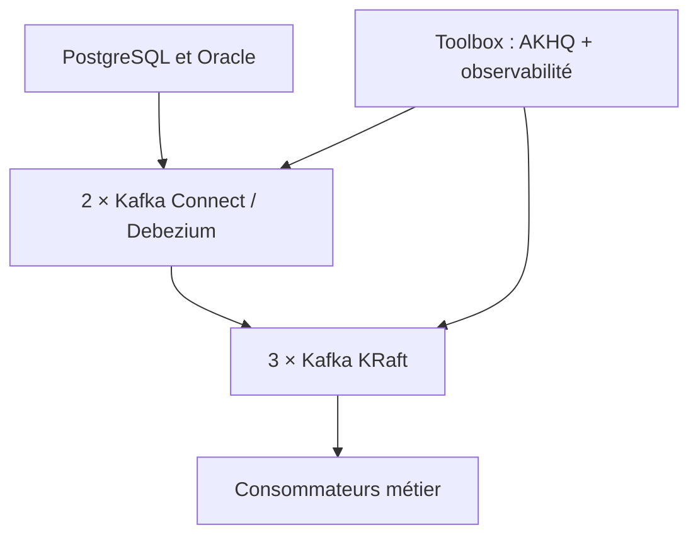

# Stack CDC Kafka / Debezium hors-ligne sur RHEL 8.10

Ce projet installe la plateforme convenue sur des VM `x86_64` :

- 3 brokers Apache Kafka 3.9.2 en mode KRaft combiné broker/controller ;
- 2 workers Kafka Connect distribués avec Debezium 3.1.3.Final, connecteurs PostgreSQL et Oracle ;
- 1 VM toolbox avec AKHQ 0.28.0 en JAR, Prometheus, Alertmanager, Grafana, Kafka Exporter et Blackbox Exporter ;
- Node Exporter sur toutes les VM et JMX Exporter sur Kafka et Connect ;
- Java 21 pour Kafka, Connect et les outils CLI ; JRE Temurin 25 isolé uniquement pour AKHQ ;
- TLS mutuel, ACL Kafka, firewalld, SELinux conservé en mode enforcing et services systemd.

Les VM ne téléchargent rien. Les RPM système proviennent uniquement des dépôts déjà configurés sur RHEL ; tous les autres binaires sont copiés depuis `airgap-bundle/` par le contrôleur Ansible.

Le mode broker/controller combiné tient sur les trois VM demandées et conserve un quorum de trois contrôleurs. Pour une plateforme extrêmement critique ou à très forte charge, séparer trois contrôleurs dédiés des brokers réduit le couplage entre plan de contrôle et trafic de données, au prix de trois VM supplémentaires.

## Architecture



Spark et Iceberg ne font volontairement pas partie de ce premier déploiement. Ils sont utiles en aval pour constituer un lakehouse analytique, pas pour assurer le transport CDC. Voir [docs/spark-iceberg.md](docs/spark-iceberg.md).

## Pré-requis

Contrôleur Ansible :

- Linux avec `ansible-core` (une version compatible avec le Python de RHEL 8 ; `ansible-core 2.16` convient au Python système historique de RHEL 8) ;
- `python3`, `openssl`, `sha512sum`, accès SSH et sudo sans interaction vers les six VM ;
- aucun rôle Galaxy ni collection additionnelle.

VM cibles :

- RHEL **8.10** `x86_64`, SELinux enforcing ;
- résolution DNS directe entre toutes les VM, ou adresses ajoutées automatiquement dans `/etc/hosts` ;
- synchronisation NTP ;
- dépôts RHEL internes contenant les paquets listés dans `common_rhel_packages` ;
- disques dédiés recommandés pour `/var/lib/kafka/data`, `/var/lib/kafka/metadata` et `/var/lib/prometheus`.

## 1. Préparer le bundle air-gap

Sur une machine connectée, récupérez les fichiers listés dans [artifact-manifest.yml](artifact-manifest.yml), contrôlez leurs signatures ou sommes publiées par les éditeurs, puis transférez-les en conservant exactement ces noms :

```text
airgap-bundle/
├── artifacts/
│   ├── kafka/kafka_2.13-3.9.2.tgz
│   ├── debezium/
│   │   ├── debezium-connector-postgres-3.1.3.Final-plugin.tar.gz
│   │   ├── debezium-connector-oracle-3.1.3.Final-plugin.tar.gz
│   │   ├── ojdbc11-21.15.0.0.jar
│   │   ├── xdb-21.15.0.0.jar
│   │   └── xmlparserv2-21.15.0.0.jar
│   ├── monitoring/
│   │   ├── jmx_prometheus_javaagent-1.6.0.jar
│   │   ├── prometheus-3.13.2.linux-amd64.tar.gz
│   │   ├── alertmanager-0.34.0.linux-amd64.tar.gz
│   │   ├── node_exporter-1.12.1.linux-amd64.tar.gz
│   │   ├── kafka_exporter-1.9.0.linux-amd64.tar.gz
│   │   ├── blackbox_exporter-0.28.0.linux-amd64.tar.gz
│   │   └── grafana_13.2.0_32077357341_linux_amd64.rpm
│   └── toolbox/
│       ├── akhq-0.28.0-all.jar
│       └── OpenJDK25U-jre_x64_linux_hotspot_25.0.4.1_1.tar.gz
└── checksums/SHA512SUMS
```

Une fois les fichiers déposés :

```bash
./scripts/build-sha512sums.sh
./scripts/verify-airgap-bundle.sh
```

Le SHA-512 local protège ensuite le transfert et les déploiements répétés. Il ne remplace pas la vérification de provenance effectuée sur la machine connectée.

## 2. Déclarer les VM et leurs rôles

Éditez uniquement [inventories/production/hosts.yml](inventories/production/hosts.yml). Remplacez les six noms et leurs `ansible_host`. Les adresses IPv4 sont nécessaires pour SSH, les SAN des certificats et firewalld.

```yaml
kafka:
  hosts:
    kafka01.mondomaine:
      ansible_host: 10.20.30.11
kafka_connect:
  hosts:
    connect01.mondomaine:
      ansible_host: 10.20.30.21
monitoring:
  hosts:
    toolbox01.mondomaine:
      ansible_host: 10.20.30.31
```

Conservez exactement 3 membres dans `kafka`, au moins 2 dans `kafka_connect` et 1 dans `monitoring`. Les réglages prêts à l'emploi se trouvent dans [inventories/production/group_vars/all.yml](inventories/production/group_vars/all.yml). Si plusieurs dépôts sont configurés sur RHEL, placez les identifiants autorisés dans `rhel_internal_repo_ids` : DNF désactivera alors tous les autres pendant le déploiement.

## 3. Déployer

Depuis la racine du projet :

```bash
ansible-inventory --graph
ansible stack -m ping
ansible-playbook site.yml
```

Le précontrôle arrête immédiatement le run si la topologie, la plateforme, un artefact ou une somme SHA-512 est incorrect. À la fin, le rôle `verify` vérifie le quorum KRaft, les métadonnées Kafka, les plugins Debezium et les services d'observabilité.

Le premier run crée `.state/` sur le contrôleur avec :

- l'identifiant immuable du cluster KRaft ;
- l'autorité de certification et les clés privées ;
- les mots de passe des keystores, Grafana et AKHQ.

**Sauvegardez `.state/` dans un coffre chiffré. Ne le supprimez jamais entre deux exécutions.** Une perte de l'identifiant KRaft ou de la CA rendrait le redéploiement incohérent avec les nœuds existants.

Pour afficher les identifiants initiaux :

```bash
./scripts/show-generated-credentials.sh
```

Des valeurs gérées par Ansible Vault peuvent remplacer les secrets automatiques ; copiez `vault.yml.example` vers `vault.yml`, renseignez les variables `*_override`, puis chiffrez le fichier.
Dans ce cas, le script d'affichage montre encore les valeurs générées et non les overrides du Vault.

## 4. Accéder aux interfaces

Par défaut Grafana, Prometheus, Alertmanager et AKHQ écoutent uniquement sur `127.0.0.1` de la toolbox. Ouvrez des tunnels depuis votre poste :

```bash
ssh \
  -L 3000:127.0.0.1:3000 \
  -L 8080:127.0.0.1:8080 \
  -L 9090:127.0.0.1:9090 \
  ansible@toolbox01.mondomaine
```

- Grafana : `http://127.0.0.1:3000`
- AKHQ : `http://127.0.0.1:8080`
- Prometheus : `http://127.0.0.1:9090`

Pour les exposer sur le réseau, changez `ui_bind_address` et renseignez obligatoirement `ui_allowed_cidrs`. Le playbook refuse une exposition sans liste de sources autorisées. Placez idéalement un reverse proxy HTTPS d'entreprise devant les interfaces.

## Rôles fournis

| Rôle | Fonction |
|---|---|
| `airgap_preflight` | Valide inventaire, artefacts, SHA-512 ; persiste secrets et cluster ID |
| `pki_controller` | Crée la CA, les certificats mTLS et les keystores PKCS#12 |
| `common` | Valide RHEL 8.10, installe les RPM internes, configure NTP, hôtes, limites et noyau |
| `java21` | Installe et contrôle OpenJDK 21 |
| `node_exporter` | Expose les métriques OS sur toutes les VM |
| `kafka` | Déploie 3 nœuds KRaft, TLS/mTLS, autorisation et JMX |
| `kafka_acls` | Accorde les droits de Connect, AKHQ, Kafka Exporter et clients optionnels |
| `kafka_connect` | Déploie deux workers, les deux plugins Debezium et les pilotes Oracle |
| `monitoring` | Déploie Prometheus, Alertmanager, Grafana, exporters et Kafka CLI |
| `akhq` | Déploie le JAR AKHQ avec son JRE 25 isolé et deux profils locaux |
| `verify` | Effectue les contrôles de bout en bout sans créer de données métier |

## Sécurité et comportement CDC

- Tous les flux Kafka, y compris le quorum KRaft, utilisent TLS avec authentification cliente obligatoire.
- L'autorisation Kafka est fermée par défaut (`allow.everyone.if.no.acl.found=false`).
- Les APIs Kafka Connect restent en HTTP mais ne sont ouvertes par firewalld qu'à la toolbox ; elles ne doivent pas être routées depuis un réseau utilisateur.
- Les interfaces d'administration sont locales par défaut.
- Les règles ajoutées ne suppriment pas d'éventuelles ouvertures firewalld préexistantes ; auditez les zones et services déjà présents sur les VM.
- Les secrets ne sont ni journalisés par Ansible (`no_log`) ni placés dans Git.
- Debezium 3.1.3 doit être traité comme une chaîne **au moins une fois** : après reprise, un événement peut être réémis. Les consommateurs doivent être idempotents, par exemple avec une clé métier et la position source contenue dans l'enveloppe Debezium.
- Les convertisseurs JSON avec schémas sont activés. Aucun Schema Registry n'est imposé à ce stade.

Les ACL de la toolbox donnent au principal Kafka d'AKHQ des capacités d'administration, puis AKHQ sépare les comptes `admin` et `lecture` dans son interface. Si votre politique exige une séparation Kafka stricte, déployez deux instances ou deux connexions AKHQ avec des certificats distincts.

Pour autoriser de futurs consommateurs, ajoutez leurs réseaux dans `kafka_additional_client_allowed_cidrs`. La liste facultative `pki_extra_clients` génère leurs certificats sous `.state/pki/identities/client-<nom>` et des ACL de lecture génériques ; adaptez `roles/kafka_acls` à vos préfixes de topics et groupes avant la production.

## Activer les captures de bases

Le playbook installe les plugins mais ne crée aucun connecteur source tant que les versions, éditions, volumes et topologies des bases ne sont pas connus.

1. Préparez la base et le compte technique selon [docs/database-readiness.md](docs/database-readiness.md).
2. Copiez un exemple depuis [examples/connectors](examples/connectors).
3. Créez sur **chaque worker** le même fichier secret, par exemple `/etc/kafka-connect/secrets/postgres-exemple.properties`, propriétaire `root:kafka-connect`, mode `0640`.
4. Adaptez les noms de tables, le `topic.prefix`, le slot/publication PostgreSQL ou les paramètres Oracle.
5. Ouvrez un tunnel vers l'API Connect, qui n'est accessible que depuis la toolbox par défaut :

```bash
ssh -L 18083:connect01.mondomaine:8083 ansible@toolbox01.mondomaine
```

6. Dans un second terminal, validez puis appliquez :

```bash
curl -s http://127.0.0.1:18083/connector-plugins
./scripts/register-connector.sh \
  http://127.0.0.1:18083 \
  examples/connectors/postgresql-source.json
```

Le second worker partage automatiquement la configuration, les offsets et les statuts via les trois topics internes répliqués. Consultez [docs/operations.md](docs/operations.md) avant une mise en production.

## Ce qui reste à préciser

Avant de créer les connecteurs réels, il faudra fixer pour chaque base : version exacte, édition, CDB/PDB/RAC/Data Guard côté Oracle, tables capturées, volume initial, débit de changements, rétention WAL/redo, latence attendue et stratégie de snapshot. Ces réponses détermineront le dimensionnement Connect, les paramètres de capture et le nombre de connecteurs — sans modifier l'architecture de base livrée ici.
